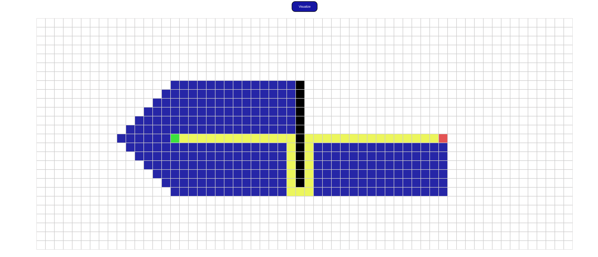

# Pathfinding visualizer

Inspired by Clement's pathfinding visualizer, I have decided to make my own.
This project currently has A\* algorithm but I'm planning to add more.

## To do:

- Add Dijkstra algorithm
- Add Maze generation
- DFS and BFS
- Fix bugs
- Clean code
- Add wall dragging

## Resources:

[Wikipedia](https://en.wikipedia.org/wiki/Pathfinding#RIPA_algorithm)
[Sebastian Lague](https://www.youtube.com/watch?v=-L-WgKMFuhE)
[The Coding Train](https://www.youtube.com/watch?v=aKYlikFAV4k)

## Example

